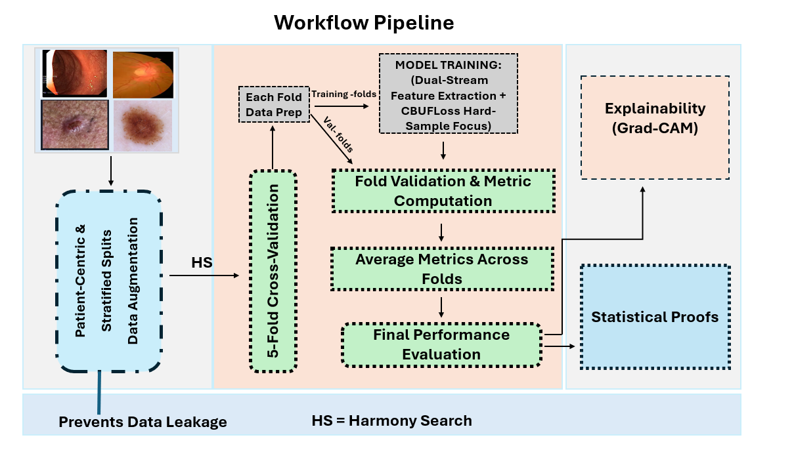
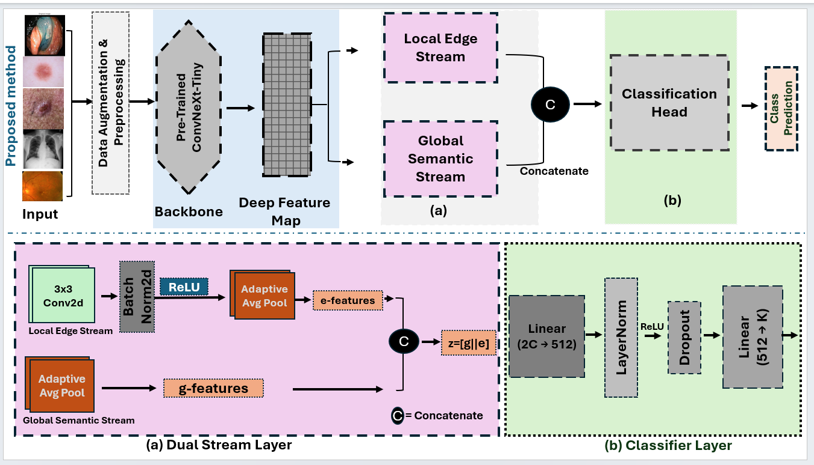

# A Unified Calibration-Aware Dual-Stream Framework for Heterogeneous and Imbalanced Medical Image Classification

This repository contains the implementation accompanying the paper:

**A Unified Calibration-Aware Dual-Stream Framework for Heterogeneous and Imbalanced Medical Image Classification**

The code provides the complete experimental pipeline used for model training, hyperparameter optimisation, validation, evaluation, visualisation, and final production-model training.

### System Workflow
The overall pipeline illustrates how heterogeneous medical image modalities are handled, preprocessed, and routed through our dual-stream framework.



### UCADS Model Architecture
The structural design of the Unified Dual-Stream (UCADS) framework highlights the stream interactions and how class imbalances are handled during feature extraction.




## Method Overview

The framework consists of a dual-stream architecture combining:

* a pretrained ConvNeXt-Tiny backbone for global image representation;
* a lightweight edge stream based on convolution, batch normalisation, and ReLU for local structural information;
* feature fusion between the global and local streams;
* a class-balanced focal loss for handling class imbalance;
* weighted sampling during training;
* Harmony Search-based hyperparameter selection;
* five-fold stratified group cross-validation;
* bootstrap confidence intervals for evaluation;
* Grad-CAM visualisation for model interpretation.

The implementation is organised into separate modules to make the experimental pipeline easier to inspect, reproduce, and reuse.

## Installation

Create a Python environment and install the required dependencies:

```bash
pip install -r requirements.txt
```

The exact package versions used for the experiments are provided in `requirements.txt`.

## Dataset

The code expects the dataset images and corresponding CSV files to be available locally.

The dataset itself is **not included in this repository**. Please obtain the data from the appropriate official sources and ensure that its terms of use permit research use. 

### Data Sources & Citations
For a complete breakdown of the four clinical domains, imaging modalities, and baseline criteria used in this implementation, please refer to our accompanying publication:
* **Paper DOI**: [https://doi.org/10.3390/computers15090629](https://doi.org/10.3390/computers15090629)


## Configuration

The main experimental settings are defined in:

```text
configs/config.py
```

These include:

* image size;
* number of classes;
* random seed;
* number of training epochs;
* Harmony Search trials;
* Harmony Search training epochs;
* training and testing paths;
* class names;
* computational device.

Modify the dataset paths in the configuration before running the experiments.

## Running the Experiment

The main experiment can be started using:

```bash
python scripts/run_experiment.py
```

The execution calls:

```python
from src.train import main

if __name__ == "__main__":
    main()
```

The `train.py` module coordinates the complete experimental workflow and imports the model, loss, dataset, optimisation, evaluation, sampling, and visualisation components from the corresponding modules.

## Code Organisation

### Model

```text
src/model.py
```

Contains the `DualStreamModel` implementation, including the ConvNeXt-Tiny global feature stream, local edge stream, feature fusion, and classification head.

### Loss Function

```text
src/loss.py
```

Contains the `CBFocalLoss` implementation used to address class imbalance.

### Dataset

```text
src/dataset.py
```

Contains the medical image dataset loading and preprocessing interface.

### Sampling

```text
src/sampler.py
```

Contains the weighted sampling procedure used during model training.

### Hyperparameter Optimisation

```text
src/optimisation.py
```

Contains the Harmony Search procedure used to select training hyperparameters.

### Evaluation

```text
src/evaluation.py
```

Contains validation, inference, classification metrics, bootstrap confidence intervals, and the implemented ECE calculation.

### Visualisation

```text
src/visualisation.py
```

Contains the generation of training-history plots, confusion matrices, ROC curves, and Grad-CAM visualisations.

### Training Pipeline

```text
src/train.py
```

Coordinates the complete experimental workflow, including data loading, hyperparameter optimisation, cross-validation, model training, checkpoint generation, evaluation, visualisation, and final production-model training.

research data or model-hosting service, subject to the relevant data and institutional policies.

## Reproducibility

The implementation sets the random seed for Python, NumPy, PyTorch, and CUDA where available.

The main experimental configuration is defined centrally in:

```text
configs/config.py
```

The training pipeline uses stratified group cross-validation and records fold-level evaluation results.

For exact reproduction of the published experiments, use the configuration and dependency versions provided in this repository together with the corresponding dataset version.

## Calibration

The implementation contains an Expected Calibration Error (ECE) calculation as part of the evaluation code.

However, the numerical ECE results are not reported in the accompanying manuscript because the corresponding final numerical records were not retained. Therefore, this repository should not be interpreted as providing reported quantitative calibration results for the study.

## Citation

If you use this code or the associated methodology in your research, please cite the accompanying paper:

```text
Ovuehor, S., El-Dalahmeh, A., Adeel, U., & Li, J. (2026). A Unified Dual-Stream Framework for Heterogeneous and Imbalanced Medical Image Classification. Computers, 15(9), 629.
```

DOI:

```text
https://doi.org/10.3390/computers15090629
```

## License
You are free to share and adapt the material, provided you give appropriate credit by citing our accompanying paper.


## Acknowledgement

The research was conducted using the computational resources available to the authors and their institution. Any required institutional or computational acknowledgements should be retained in accordance with the published paper.

